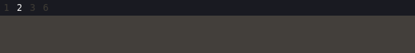

<div align="center">

  <a href="https://github.com/orhun/runst">
    
  </a>

<h4><strong><code>runst</code></strong> — A dead simple notification daemon 🦡</h4>

<a href="https://github.com/orhun/runst/releases"></a>
<a href="https://crates.io/crates/runst/"></a>
<a href="https://github.com/orhun/runst/actions?query=workflow%3A%22Continuous+Integration%22"></a>
<a href="https://github.com/orhun/runst/actions?query=workflow%3A%22Continuous+Deployment%22"></a>
<a href="https://docs.rs/runst/"></a>

</div>

[Desktop notifications](https://wiki.archlinux.org/title/Desktop_notifications) are small, passive popup dialogs that notify the user of particular events in an asynchronous manner. These passive popups can automatically disappear after a short period of time.

`runst` is the server implementation of [freedesktop.org](https://www.freedesktop.org/wiki) - [Desktop Notifications Specification](https://specifications.freedesktop.org/notification-spec/notification-spec-latest.html) and it can be used to receive notifications from applications via [D-Bus](https://www.freedesktop.org/wiki/Software/dbus/). As of now, only [X11](https://en.wikipedia.org/wiki/X_Window_System) is supported.

<div align="center">

  <a href="https://github.com/orhun/runst">
    
  </a>

</div>

## Features

- Fully customizable notification window (size, location, text, colors).
- Template-powered ([Jinja2](http://jinja.pocoo.org/)/[Django](https://docs.djangoproject.com/en/3.1/topics/templates/)) notification text.
- Auto-clear notifications based on a fixed time or estimated read time.
- Run custom OS commands based on the matched notifications.
- Z-Bus based notification backend (Rust IPC handling over the D-Bus protocol)

## Roadmap

`runst` is initially designed to show a simple notification window. On top of that, it combines customization-oriented and semi-innovative features. In the future, I'm aiming to shape `runst` functionality based on new ideas and feedback.

Feel free to [submit an issue](https://github.com/orhun/runst/issues/new) if you have something in mind or having a problem!

## Installation

### From crates.io

`runst` can be installed from [crates.io](https://crates.io/crates/runst):

```sh
$ cargo install runst
```

The minimum supported Rust version is `1.70.0`.

### Arch Linux

`runst` can be installed from the [extra repository](https://archlinux.org/packages/extra/x86_64/runst/) using [pacman](https://wiki.archlinux.org/title/Pacman):

```sh
$ pacman -S runst
```

Or you can install the available [AUR packages](https://aur.archlinux.org/packages?O=0&SeB=nd&K=runst&outdated=&SB=p&SO=d&PP=50&submit=Go) with using an [AUR helper](https://wiki.archlinux.org/title/AUR_helpers). For example:

```sh
$ paru -S runst-git
```

### Alpine Linux

`runst` is available for [Alpine Edge](https://pkgs.alpinelinux.org/packages?name=runst&branch=edge). It can be installed via [apk](https://wiki.alpinelinux.org/wiki/Alpine_Package_Keeper) after enabling the [testing repository](https://wiki.alpinelinux.org/wiki/Repositories).

```sh
apk add runst
```

### Binary releases

See the available binaries for different operating systems/architectures from the [releases page](https://github.com/orhun/runst/releases).

Release tarballs are signed with the following PGP key: [AEF8C7261F4CEB41A448CBC41B250A9F78535D1A](https://keyserver.ubuntu.com/pks/lookup?search=0x1B250A9F78535D1A&op=vindex)

### Build from source

#### Prerequisites

- [Z-Bus](https://docs.rs/zbus/latest/zbus/#example-code)
- [ZVariant](https://docs.rs/zvariant/latest/zvariant/)
- [Pango](https://pango.gnome.org)

#### Instructions

1. Clone the repository.

```sh
$ git clone https://github.com/orhun/runst && cd runst/
```

2. Build.

```sh
$ CARGO_TARGET_DIR=target cargo build --release
```

Binary will be located at `target/release/runst`.

## Usage

### On Xorg startup

You can use [xinitrc](#xinitrc) or [xprofile](#xprofile) for autostarting `runst`.

#### xinitrc

If you are starting Xorg manually with [xinit](https://www.x.org/archive/X11R6.8.0/doc/xinit.1.html), you can `runst` on X server startup via [xinitrc](https://wiki.archlinux.org/title/Xinit#xinitrc):

`$HOME/.xinitrc`:

```sh
runst &
```

Long-running programs such as notification daemons should be started before the window manager, so they should either fork themself or be run in the background via appending `&` sign. Otherwise, the script would halt and wait for each program to exit before executing the window manager or desktop environment.

In the case of `runst` not being available since it's started at a faster manner than the window manager, you can add a delay as shown in the example below:

```sh
{ sleep 2; runst; } &
```

#### xprofile

If you are using a [display manager](https://wiki.archlinux.org/title/Display_manager), you can utilize an [xprofile](https://wiki.archlinux.org/title/Xprofile) file which allows you to execute commands at the beginning of the X user session.

The xprofile file, which is `~/.xprofile` or `/etc/xprofile`, can be styled similarly to [xinitrc](#xinitrc).

### As a D-Bus service

Although `runst` now uses a Z-Bus backend internally, it still exposes the standard `org.freedesktop.Notifications` interface on the session D-Bus. In other words, Z-Bus handles the backend inside `runst`, while the activation mechanism is still D-Bus. Because of that, you can still use a regular D-Bus service file to launch `runst` automatically on the first notification action. For example, you can create the following service configuration:

`/usr/share/dbus-1/services/org.orhun.runst.service`:

```ini
[D-BUS Service]
Name=org.freedesktop.Notifications
Exec=/usr/bin/runst
```

Whenever an application sends a notification by sending a signal to `org.freedesktop.Notifications`, D-Bus activates `runst`.

Also, see [**#1**](https://github.com/orhun/runst/issues/1) for systemd integration.

## Commands

`runst` can be controlled with sending commands to D-Bus via [`dbus-send(1)`](https://man.archlinux.org/man/dbus-send.1.en).

```sh
dbus-send --print-reply --dest=org.freedesktop.Notifications /org/freedesktop/Notifications/ctl "org.freedesktop.Notifications.${command}"
```

Available commands are:

- `History`: show the last notification.
- `Close`: close the notification.
- `CloseAll`: close all the notifications.

For example:

```sh
# show the last notification
dbus-send --print-reply \
          --dest=org.freedesktop.Notifications \
          /org/freedesktop/Notifications/ctl \
          org.freedesktop.Notifications.History
```

An example usage for [i3](https://i3wm.org/):

```sh
# Notification history
bindsym $mod+grave exec dbus-send --print-reply \
        --dest=org.freedesktop.Notifications /org/freedesktop/Notifications/ctl org.freedesktop.Notifications.History

# Close notification
bindsym $mod+shift+grave exec dbus-send --print-reply \
        --dest=org.freedesktop.Notifications /org/freedesktop/Notifications/ctl org.freedesktop.Notifications.Close
```

Additionally, to view the server version:

```sh
dbus-send --print-reply --dest=org.freedesktop.Notifications /org/freedesktop/Notifications org.freedesktop.Notifications.GetServerInformation
```

## Configuration

`runst` configuration file supports [TOML](https://github.com/toml-lang/toml) format and the default configuration values can be found [here](./config/runst.toml).

If exists, configuration file is read from the following default locations:

- `$HOME/.config/runst/runst.toml`
- `$HOME/.runst/runst.toml`

You can also specify a path via `RUNST_CONFIG` environment variable.

### Global configuration

#### `log_verbosity`

Sets the [logging verbosity](https://docs.rs/log/latest/log/enum.Level.html). Possible values are `error`, `warn`, `info`, `debug` and `trace`.

#### `startup_notification`

Shows a notification at startup if set to `true`.

#### `geometry`

Sets the window geometry. The value format is `<width>x<height>+<x>+<y>`.

For setting this value, I recommend using a tool like [slop](https://github.com/naelstrof/slop) which helps with querying for a selection and printing the region to stdout.

#### `wrap_content`

If set to `true`, the window is resized to match the contents.

If the content is larger than the window size, `geometry` option is used for maximum width and height.

#### `font`

Sets the font to use for the window.

#### `template`

Sets the template for the notification message. The syntax is based on [Jinja2](http://jinja.pocoo.org/) and [Django](https://docs.djangoproject.com/en/3.1/topics/templates/) templates.

Simply, there are 3 kinds of delimiters:

<!--  -->

- `{{` and `}}` for expressions
- `{%` or `` or `-%}` for statements
- `{#` and `#}` for comments

<!--  -->

See [Tera documentation](https://tera.netlify.app/docs/#templates) for more information about [control structures](https://tera.netlify.app/docs/#control-structures), [built-in filters](https://tera.netlify.app/docs/#built-ins), etc.

##### Context

Context is the model that holds the required data for template rendering. The [JSON](https://en.wikipedia.org/wiki/JSON) format is used in the following example for the representation of a context.

```json
{
  "app_name": "runst",
  "summary": "example",
  "body": "this is a notification 🦡",
  "urgency": "normal",
  "unread_count": 1,
  "timestamp": 1672426610
}
```

##### Styling

[Pango](https://pango.gnome.org/) is used for text rendering. The markup documentation can be found [here](https://docs.gtk.org/Pango/pango_markup.html).

A few examples would be:

- `<b>bold text</b>`: **bold text**
- `<span foreground="blue">blue text</span>`: <span style="color:blue">blue text</span>
- `<tt>monospace text</tt>`: <tt>monospace text</tt>

### Urgency configuration

There are 3 levels of urgency defined in the [Freedesktop](https://specifications.freedesktop.org/notification-spec/notification-spec-latest.html) specification and they define the importance of the notification.

1. `low`: e.g. "joe signed on"
2. `normal`: e.g. "you got mail"
3. `critical`: e.g. "your computer is on fire!"

You can configure `runst` to act differently based on these urgency levels. For this, there need to be 3 different sections defined in the configuration file. Each of these sections has the following fields:

```toml
[urgency_{level}] # urgency_low, urgency_normal or urgency_critical
    background = "#000000" # background color
    foreground = "#ffffff" # foreground color
    timeout = 10
    auto_clear = true
    text = "normal"
    custom_commands = []
```

#### `timeout`

This is the default timeout value (in seconds) if the notification has no timeout specified by the sender. If the timeout is 0, the notification is not automatically closed (i.e. it never expires).

#### `auto_clear`

If set to `true`, the **estimated read time** of the notification is calculated and it is used as the timeout. This is useful if you want the notifications to disappear as you finish reading them.

#### `text`

This is the custom text for the urgency level and can be used in [template context](#context) as `urgency`. If it is not set, the corresponding urgency level is used (e.g. "low", "normal" or "critical").

#### `custom_commands`

With using this option, you can run custom OS commands based on urgency levels and the notification contents. The basic usage is the following:

```toml
custom_commands = [
    { command = 'echo "{{app_name}} {{summary}} {{body}}"' } # echoes the notification to stdout
]
```

As shown in the example above, you can specify an arbitrary command via `command` which is also processed through the template engine. This means that you can use the same [template context](#context).

The filtering is done by matching the fields in JSON via using `filter` along with the `command`. For example, if you want to play a custom notification sound for a certain application:

```toml
custom_commands = [
  { filter = '{ "app_name":"notify-send" }', command = 'aplay notification.wav' },
  { filter = '{ "app_name":"weechat" }', command = 'aplay irc.wav' }
]
```

The JSON filter can have the following fields:

- `app_name`: Name of the application that sends the notification.
- `summary`: Summary of the notification.
- `body`: Body of the notification.

Each of these fields is matched using regex and you can combine them as follows:

```toml
custom_commands = [
  { filter = '{ "app_name":"telegram|discord|.*chat$","body":"^hello.*" }', command = 'gotify push -t "{{app_name}}" "someone said hi!"' }
]
```

In this hypothetical example, we are sending a [Gotify](https://gotify.net/) notification when someone says hi to us in any chatting application matched by the regex.

## Why this exists?

I have been a user of [dunst](https://github.com/dunst-project/dunst) for a long time. However, they made some [uncool breaking changes](https://github.com/dunst-project/dunst/issues/940) in [v1.7.0](https://github.com/dunst-project/dunst/releases/tag/v1.7.0) and it completely broke my configuration. That day, I refused to update `dunst` (I was too lazy to re-configure) and decided to write my own notification server using Rust.

I wanted to keep `runst` simple since the way I use `dunst` was really simple. I was only showing an overlay window on top of [i3status](https://github.com/i3/i3status) as shown below:



And that's how `runst` is born.

## Similar projects

- [wired-notify](https://github.com/Toqozz/wired-notify)

## License

Licensed under either of [Apache License Version 2.0](http://www.apache.org/licenses/LICENSE-2.0) or [The MIT License](http://opensource.org/licenses/MIT) at your option.

## Copyright

Copyright © 2022-2024, [Orhun Parmaksız](mailto:orhunparmaksiz@gmail.com)
